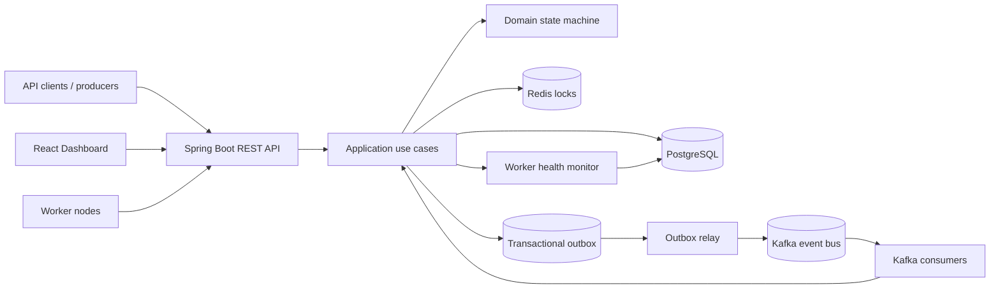
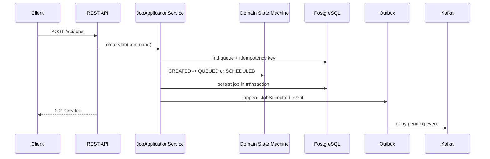
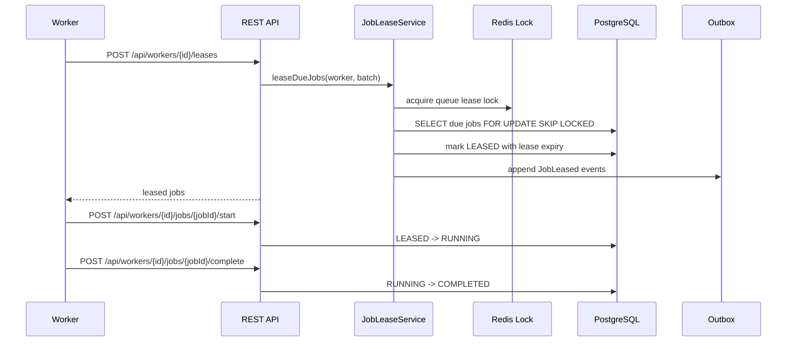
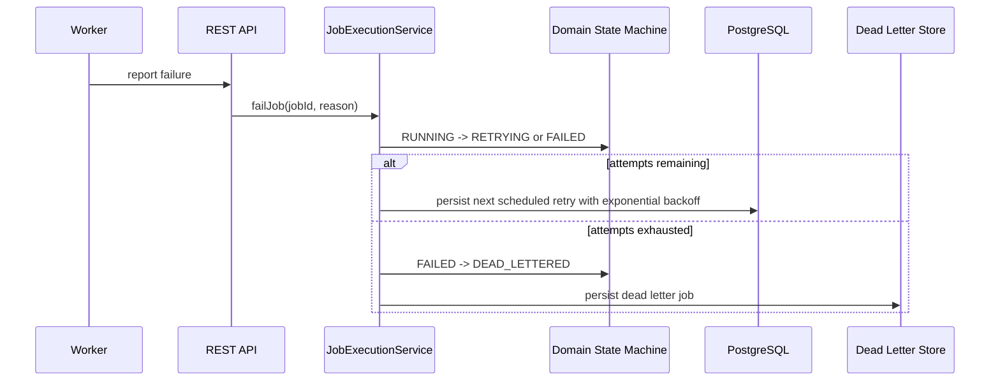
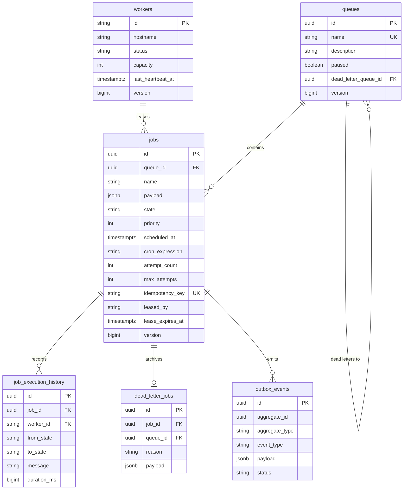
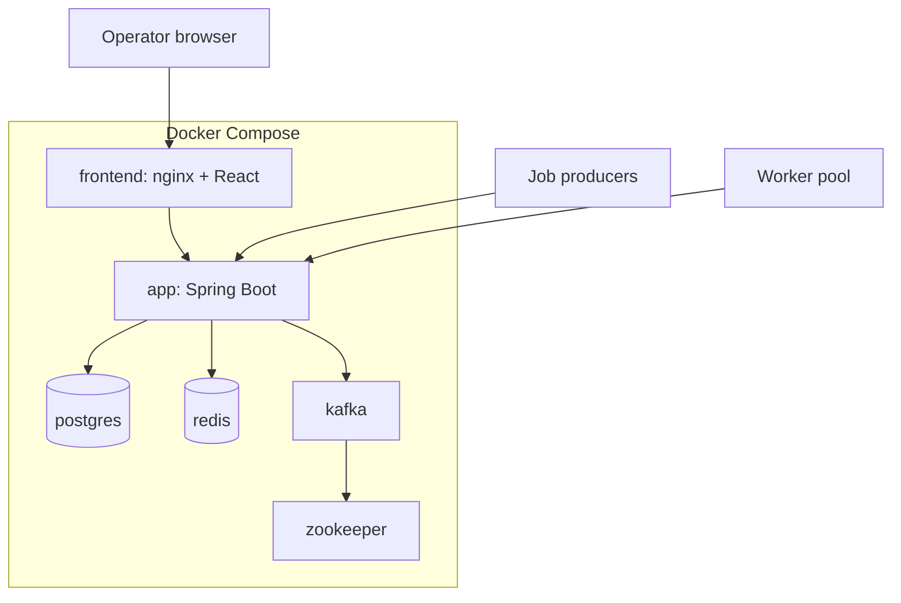

# Distributed Job Scheduling Platform Architecture

This project implements a production-oriented distributed scheduler inspired by Google Cloud Tasks. The backend follows hexagonal architecture: domain rules live in `domain`, use cases in `application`, adapters in `infrastructure`, and HTTP contracts in `api`.

## Folder Structure

```text
.
├── backend
│   ├── src/main/java/com/example/scheduler
│   │   ├── domain
│   │   ├── application
│   │   ├── infrastructure
│   │   └── api
│   ├── src/main/resources/db/migration
│   └── src/test/java/com/example/scheduler
├── frontend
│   └── src
├── docs
└── docker-compose.yml
```

## High Level Architecture



## Job Submission Sequence



## Leasing and Completion Sequence



## Retry and Dead Letter Sequence



## ER Diagram



## Deployment Diagram



## Scalability Notes

- PostgreSQL stores authoritative job state with optimistic locking and `FOR UPDATE SKIP LOCKED` batch leasing.
- Kafka carries state-change events and supports at-least-once event delivery.
- Redis locks coordinate batch leasing and recovery loops across app replicas.
- The transactional outbox ensures database writes and event publication cannot silently diverge.
- Workers scale horizontally by registering capacity, heartbeating, and pulling leases in batches.
- Queue pause/resume is enforced at lease time so already running work can finish gracefully.
